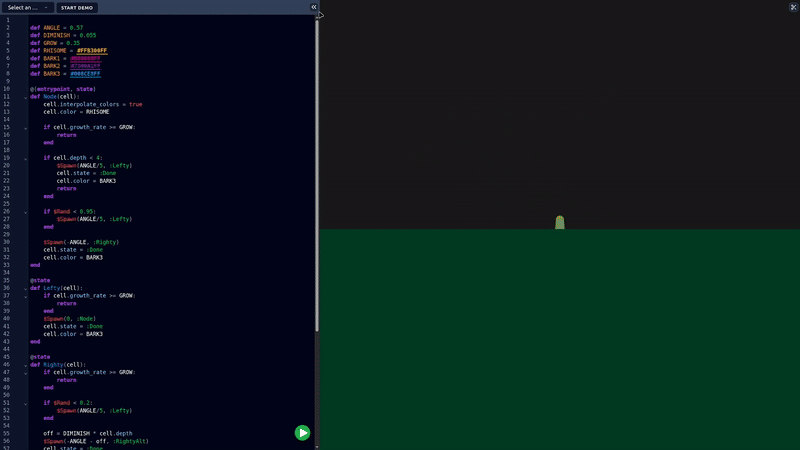

# Auxigen

<p align="center">
  
</p>

**Auxigen** is a interactive tool for the creation & simulation of artificial
plant life. The engine simulates plants as a system of constraints that act on
thousands of elements whose behaviors are specified via a program that is
authored by the user. This project is my first attempt to explore the
intersection of [L-systems](https://en.wikipedia.org/wiki/L-system) with
real-time simulations.

## Key Features
- Real-Time Simulation: The core engine simulates thousands of segments simultaneously while maintaining a stable frame rate.
- Custom Scripting Language: A custom programming language allows users to specify botanical growth rules with arbitrary complexity. 
- Integrated Web IDE: Includes a built-in code editor equipped with syntax highlighting, diagnostic error parsing, and scope folding.

## 🌱 Custom Language Syntax (`.pil`)
Auxigen features a domain-specific, state-machine-driven programming language
designed specifically to author cellular growth rules and structural splitting
dynamics. Below is an evaluation program (`willow.pil`) showcasing annotations,
deterministic growth branches, state changes, and stochastic behavior.

```python
# Constants & Color Palette Configuration
def ANGLE = 0.37
def GROW = 0.15
def RHISOME = #374F3CFF
def BARK1 = #614428FF
def BARK2 = #472D14FF
def LEAF1 = #20422DC2
def FLOWER1 = #AA00FF91
def FLOWER2 = #FF00E791

# The initial simulation seed state execution
@(entrypoint, state)
def Node(cell):
    cell.interpolate_colors = true
    cell.color = RHISOME

    if cell.growth_rate >= GROW:
        return
    end

    # Handle deep structural variations dynamically
    if cell.depth > 8:
        if $Rand < 0.99:
            $Spawn(0, :Streamer)
            cell.state = :Vine
        end
    end

    # Inline ternary evaluation paired with stochastic engine branching
    turn = ANGLE if $Rand > 0.5 else -ANGLE
    if $Rand > 0.5:
        $Spawn(turn / 4, :Node)
        cell.state = :Trunk
    else:
        $Spawn(turn, :Fork)
        cell.state = :Trunk
    end
end

@state
def Fork(cell):
    if cell.growth_rate <= GROW:
        $Spawn(ANGLE, :Node)
        $Spawn(-ANGLE, :Node)
        cell.state = :Trunk
    end
end

@state
def Trunk(cell):
    cell.state = :Trunk1 if $Rand > 0.5 else :Trunk2
end

@state
def Trunk1(cell):
    cell.color = BARK1
end

@state
def Trunk2(cell):
    cell.color = BARK2
end

@state
def Vine(cell):
    cell.color = LEAF1
end

@state
def Flower(cell):
    cell.interpolate_colors = false
    cell.thickness = 0.1
    cell.length = 0
    cell.state = :Flower1 if $Rand > 0.5 else :Flower2
end

@state
def Flower1(cell):
    cell.color = FLOWER1
end

@state
def Flower2(cell):
    cell.color = FLOWER2
end

@state
def Streamer(cell):
    if cell.growth_rate >= GROW:
        return
    end

    cell.lignen = 0
    $Spawn(0, :Streamer)
    if $Rand > 0.33:
        $Spawn(0, :Flower)
    end
    cell.state = :Vine
end
```

## 📂 Repository Tour & Architecture Map
The main separation of the project architecture is the split across the frontend & the backend. The perfomance-critical systems that comprise most of the application's functionality are implemented in Odin & located in the `./odin_workspace/` subfolder. The user interface was built with SolidJS & is located in the `./src/` directory. 

```
.
├── odin_workspace/          # Contains Odin implementations of core systems
│   ├── compiler/            # Custom compiler for the auxigen language
│   ├── vm/                  # Bytecode interpreter used by the simulation & compiler
│   ├── engine/              # Main simulation loop, Box2D integration, and WebGL pipeline
│   └── compiler_web_worker/ # WebAssembly FFI layer to allow asynchronous compilation
├── src/                     # Interactive Frontend Client (SolidJS & TailwindCSS)
│   ├── components/          # UI panels, canvas wrapper, and CodeMirror 6 configuration
│   ├── odin-bridge/         # JS-to-Wasm memory and WebGL interop layers
│   └── workers/             # Web Worker orchestration for background compilation
└── public/                  # Compiled assets and static WebAssembly binaries (.wasm)
```
### ⚡ Handcrafted FFI Architecture
Rather than relying on a heavy black-box toolchain like Emscripten, Auxigen
utilizes a custom JavaScript glue layer adapted directly from the Odin standard
library. Located within `src/odin-bridge/`, this low-level translation layer
handles direct pointer memory-mapping and routes raw WebGL calls straight from
the WebAssembly core to the browser canvas with zero-copy overhead.
Additionally, the files `./odin_workspace/engine/ffi.odin` &
`./odin_workspace/compiler_web_worker/ffi.odin` Manage small static heaps that
allow for the passage of multiple return values across the odin-to-js ffi
boundary in an efficient way. 

## 🛠️ Local Development & Build Instructions
### Prerequisites: 
- Odin Compiler (Nightly Release) 
- Bun
### How To Build
1. Clone the repository and initialize the project:
```bash
# Clone the repository
git clone git@github.com:RcCreeperTech/auxigen.git
cd auxigen
# Create the output directory for the wasm artifacts
mkdir public
# Install development dependencies
bun install
```
2. Compiling the WebAssembly Artifacts:

The simulation relies on two distinct .wasm binaries hosted in the public
directory. Compile them using the native Odin build system wrapped via Bun
scripts:
```bash
# Compile the background worker compiler (with debug symbols)
bun run build:compiler_web_worker
# Compile the simulation engine core (Development mode)
bun run build:engine
# OR compile the optimized engine for production deployment (-o:speed)
bun run build:engine-release
```
3. Running the App Local Hot-Reload:

Launch the development server driven by Vite:
```bash
bun run dev
```
Navigate to the local port output by Vite (typically http://localhost:3000) to
interact with the sandbox.

4. Running Test Suites:
The compiler frontend and virtual machine run native test structures inside the
Odin workspace to validate tokenization, parsing, and bytecode instruction sets:
```bash
# Execute verification tests on the custom compiler toolchain 
bun run test:compiler
# Execute validation tests on the virtual machine instruction layout
bun run test:vm
```
> **Host-Native Testing:** These verification suites execute natively on your
> host machine's command line via the Odin toolchain rather than inside a
> simulated browser context. This decoupling allows you to validate compiler
> mutations or VM instruction tweaks instantly without the latency of a full
> WebAssembly rebuild and browser refresh.

## Future Roadmap
Heliotropism & Phototropism: Implementing systems to query environmental factors to simulate dynamic sun-tracking and shade avoidance.

Chemical Diffusion Modeling: Simulating localized hormone or nutrient signaling (e.g., auxin gradients) to trigger complex structural pruning or flowering states.

## Acknowledgements
- Dr. Michael Soltys for academic guidance, direction, and domain expertise throughout the lifecycle of this capstone.
- The High Performance Computing (HPC) Club for fostering the systems programming skills necessary to scale the engine core.
- The open-source community for all of the tools & libraries that acted as the technical foundations of the project. Including:
  - The Odin Programming Language
  - Box2D
  - SolidJS
  - TailwindCSS
  - CodeMirror 6
  - Vite
